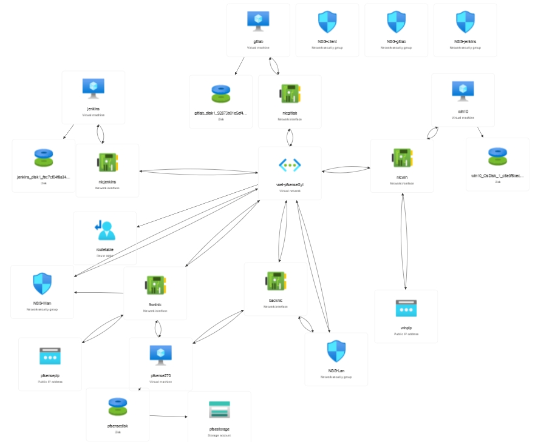

### Structure du projet 

- Prérequis au déploiement pfSense (création du VHD)
- Mise en place de l’infrastructure Azure et déploiement pfSense	
- Mise en place de Jenkins
- Mise en place de Gitlabs
- Finalisation et connexion a la vm pfSense	
- Configuration des régles de routage et accès RDP 

### Ressource

[Link pfsense](https://shop.netgate.com/products/netgate-installer) 

### Livrables

Firewall fonctionnel et VM sécurisé 

### Topologie

